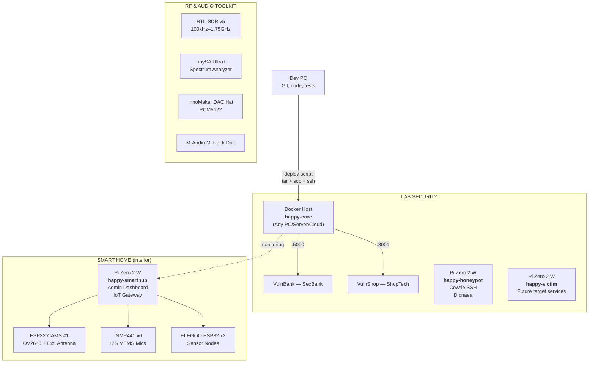

# happy — Home Security Lab

> Two integrated projects under one roof: containerized pentesting labs (deployable anywhere) and a smart home surveillance/honeypot system built with Raspberry Pi, ESP32, and real hardware.

---

## Architecture

## The Projects

### 1. Lab Security — Pentesting Lab

The core educational hacking environment. The intentionally vulnerable web apps (VulnBank, VulnShop) are fully containerized and **can be deployed anywhere** (a local PC, a cloud VPS, or a dedicated lab server). The Raspberry Pis are specifically dedicated to acting as honeypots, hardware victim nodes, and connecting IoT devices.

| Component | Hardware / Environment | Role |
|---|---|---|
| **Core Server** | Any Docker Host (PC/Server/Pi) | Docker host, monitoring, reverse proxy |
| **Honeypot** | Pi Zero 2 W | Cowrie SSH honeypot, Dionaea malware trap |
| **Victim** | Pi Zero 2 W | Future target services for exploitation |
| **VulnBank** | Docker container | Intentionally vulnerable Flask bank app (:5000) |
| **VulnShop** | Docker container | Intentionally vulnerable Express shop app (:3001) |

Pentest docs: [`labs/vulnbank/README.md`](labs/vulnbank/README.md) · [`labs/vulnshop/README.md`](labs/vulnshop/README.md)

### 2. Smart Home — Interior Surveillance

A distributed sensor network inside the house. ESP32-CAMs stream hidden video and INMP441 microphones capture audio — all feeding into a centralized admin dashboard on a Pi Zero 2 W.

| Subsystem | Hardware | Description |
|---|---|---|
| **Admin Dashboard** | Pi Zero 2 W (happy-smarthub) | Centralized panel: live camera feeds, audio streams. Accessible from PC/phone. Admin login with 2FA planned. |
| **Video** | 2x ESP32-CAM (OV2640 + OV3660), Pi Camera OV5647 175° Fisheye, 3.6mm M12 Lens | Hidden cameras distributed across the house. MJPEG over WiFi. |
| **Audio** | 6x INMP441 I2S MEMS Omnidirectional Microphones | Covert listening via ESP32 nodes over I2S bus. |
| **Sensor Nodes** | 3x ELEGOO ESP32 (Dual-Core WiFi+BT) | Each node aggregates audio sensors and reports to the hub via MQTT. |

## RF & Audio Toolkit

Shared tools across both projects for analysis, debugging, and side-channel experiments.

| Device | Description |
|---|---|
| Nooelec RTL-SDR v5 (100kHz–1.75GHz) | Software-defined radio: passive RF scanning, signal interception |
| TinySA Ultra+ Spectrum Analyzer (100kHz–5.4GHz) | Visual spectrum analysis, RF environment mapping |
| InnoMaker DAC HiFi Hat (PCM5122 384kHz/32bit) | High-quality audio output for Pi 5 (RCA/3.5mm) |
| M-Audio M-Track Duo | USB audio interface (XLR/Line/DI) for recording and analysis |

## Hardware Inventory

| Device | Qty | Project | Role |
|---|---|---|---|
| Raspberry Pi 5 (8GB) | 1 | Lab Security / Smart Home | Optional high-power node / General purpose |
| Pi Zero 2 W | 1 | Lab Security | Honeypot (Cowrie, Dionaea) |
| Pi Zero 2 W | 1 | Lab Security | Victim services |
| Pi Zero 2 W | 1 | Smart Home | Admin dashboard, IoT gateway |
| ESP32-CAM (OV2640 + ext. antenna) | 1 | Smart Home | Hidden camera #1 |
| ESP32-CAM (OV3660) | 2 | Smart Home | Hidden cameras #2/#3 |
| Pi Camera OV5647 5MP (175° fisheye) | 1 | Smart Home | Wide-angle on Pi Zero |
| Pi Camera OV5647 5MP (standard) | 1 | Smart Home | Standard lens on Pi Zero |
| ELEGOO ESP32 DevKit | 3 | Smart Home | Sensor aggregation nodes |
| INMP441 MEMS Microphone | 6 | Smart Home | Omnidirectional I2S audio |
| RTL-SDR v5 | 1 | Shared | Software-defined radio |
| TinySA Ultra+ | 1 | Shared | Spectrum analyzer |
| InnoMaker DAC HiFi Hat | 1 | Shared | Audio output (PCM5122) |
| M-Audio M-Track Duo | 1 | Shared | USB audio interface |
| GeeekPi P33 NVMe PoE+ Hat | 1 | Lab Security | NVMe SSD + PoE for Pi 5 |
| Lexar NM620 256GB NVMe SSD | 1 | Lab Security | Storage for Pi 5 |
| CP2102 USB-TTL Converter | 3 | Shared | Serial flashing for ESP32 |
| TS101 Soldering Iron (65W) | 1 | Shared | Assembly and wiring |
| 3.6mm M12 CCTV Lens | 1 | Smart Home | 90° wide-angle replacement |
| DuPont Cables (M-F, M-M, F-F) | 120 | Shared | Wiring |
| Silicone Wire 28AWG (6 colors) | 1 set | Shared | Soldering |
| SanDisk/Philips microSD (32–64GB) | 4 | Shared | Storage for Pi boards |

## Project Structure

```
happy/
├── labs/
│   ├── vulnbank/          ← Intentionally vulnerable Flask bank app
│   └── vulnshop/          ← Intentionally vulnerable Express shop app
├── core/                  ← Docker host config (optional)
├── nodes/                 ← Pi Zero 2 config (honeypot, victim, smarthub)
├── iot/                   ← ESP32 firmware (PlatformIO)
├── infra/
│   └── scripts/
│       ├── deploy.sh      ← Deploy from Linux/macOS
│       └── setup-pi.sh    ← First-time Docker install script
├── docs/                  ← Documentation
├── docker-compose.yml     ← Single compose file for all services
└── CLAUDE.md              ← AI assistant context
```

## Quick Start

### Prerequisites

- A Docker host (Linux/macOS/Windows, or a Raspberry Pi)
- SSH key-based auth configured (no passwords) if deploying remotely
- Docker installed on the host (`bash infra/scripts/setup-pi.sh` can be used for Debian/Ubuntu)

### Deploy

From your dev machine:

```bash
bash infra/scripts/deploy.sh
```

After deploy:

- **VulnBank** (SecBank) → http://<host-ip>:5000
- **VulnShop** (ShopTech) → http://<host-ip>:3001

### Local development

```bash
# VulnBank
cd labs/vulnbank && pip install -r requirements.txt && python app.py

# VulnShop
cd labs/vulnshop && pnpm install && node index.js
```

### Run tests

> **Note**: VulnBank tests require a real MySQL database to accurately test SQL injection vulnerabilities. Make sure the MySQL container is running first.

```bash
# Start MySQL container (from project root)
docker compose up -d mysql

# VulnBank (pytest)
cd labs/vulnbank && pytest tests/ -v

# VulnShop (vitest + supertest)
cd labs/vulnshop && pnpm test
```

### Deploy flow

```
Dev PC (git, code, tests)
    │
    │  deploy.sh
    │  tar → scp → ssh docker compose up
    ▼
Docker Host (happy-core, cloud VPS, or local PC)
    │  No GitHub, no personal accounts
    │  Docker containers only
    ▼
VulnBank :5000  +  VulnShop :3001
```

## Legal Disclaimer

> **Everything in this lab runs on an isolated, privately owned network.**
> Attacking third-party systems is **illegal**. This project is for education only.